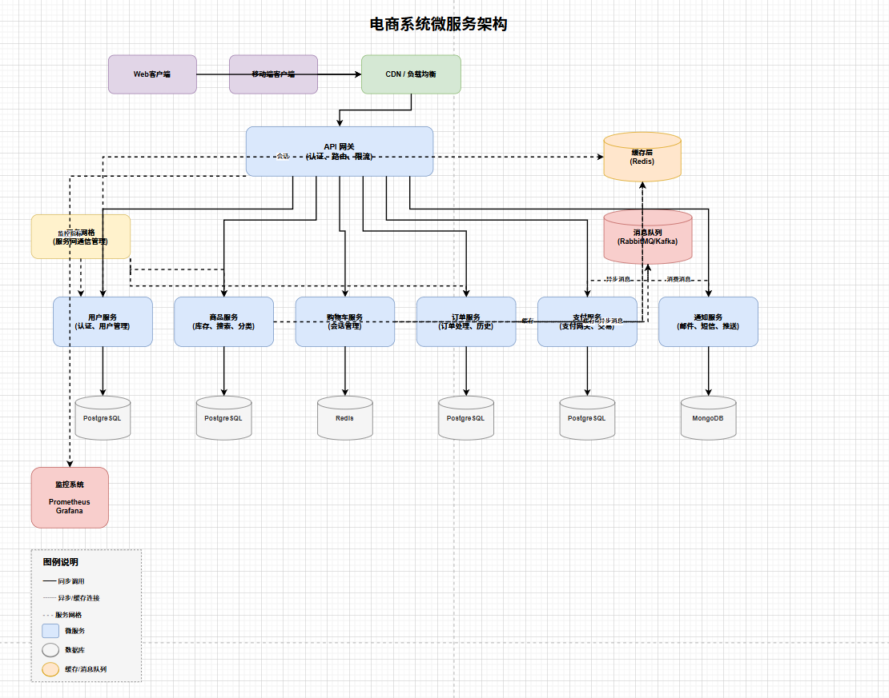

# Architecture Diagram Examples

Architecture diagrams help visualize system design and component relationships.

## E-Commerce Microservices Architecture



**Prompt:**
```
Design a microservices e-commerce system architecture diagram with the following components:

API Gateway
├── User Service (authentication, user profiles)
├── Product Catalog Service (inventory management, product search, categories)
├── Shopping Cart Service (cart management, session handling)
├── Order Service (order processing, order history)
├── Payment Service (payment gateway, transactions)
└── Notification Service (emails, SMS, push notifications)

Infrastructure:
- API Gateway (entry point for all requests)
- Service Mesh (service-to-service communication)
- Message Queue (RabbitMQ/Kafka for async events)
- Cache Layer (Redis for session and product caching)
- Databases (PostgreSQL per service)
- CDN/Load Balancer
- Monitoring (Prometheus, Grafana)
```

**Example File:** [../../examples/ecommerce-microservices.drawio](../../examples/ecommerce-microservices.drawio)

**Architecture Layers:**
1. **Client Layer**: Web and mobile clients
2. **CDN/Load Balancer**: Traffic distribution
3. **API Gateway**: Authentication, routing, rate limiting
4. **Microservices Layer**: 6 core services
   - User Service (auth, profiles)
   - Product Catalog Service (inventory, search)
   - Shopping Cart Service (session management)
   - Order Service (order processing, history)
   - Payment Service (payment gateway, transactions)
   - Notification Service (email, SMS, push)
5. **Infrastructure Layer**:
   - Service Mesh (inter-service communication)
   - Message Queue (async events)
   - Cache Layer (Redis)
6. **Data Layer**: Independent databases per service
7. **Monitoring**: Prometheus + Grafana

**Key Design Principles:**
- ✅ **KISS (Keep It Simple)**: Clear layered architecture
- ✅ **SOLID**: Service independence with separate databases
- ✅ **DRY**: Async message queue for reusable event handling
- ✅ **Observability**: Comprehensive monitoring and logging

**Connection Types:**
- Solid lines (━━): Synchronous calls
- Dashed lines (┄┄): Async/cache connections
- Dotted lines (- - -): Service mesh connections

**Use Cases:**
- E-commerce platform architecture
- Microservices system design
- Cloud-native application planning
- Service mesh implementation
- Event-driven architecture

---

## AWS Serverless Architecture

**Prompt:**
```
Generate an AWS architecture diagram with Lambda, API Gateway, DynamoDB,
and S3 for a serverless REST API. Use AWS icons.
```

**Components:**
- API Gateway (entry point)
- Lambda functions (business logic)
- DynamoDB (database)
- S3 (file storage)
- CloudWatch (monitoring)

**Use Cases:**
- Serverless application design
- API architecture documentation
- Cloud migration planning

## GCP Microservices

**Prompt:**
```
Generate a GCP architecture diagram with Cloud Run, Cloud SQL, and
Cloud Storage for a web application. Use GCP icons.
```

**Components:**
- Cloud Run (containerized services)
- Cloud SQL (managed database)
- Cloud Storage (object storage)
- Cloud Load Balancing
- Cloud Monitoring

**Use Cases:**
- Microservices architecture
- Container-based deployments
- GCP infrastructure planning

## Azure Web Application

**Prompt:**
```
Generate an Azure architecture diagram with App Service, SQL Database,
and Blob Storage. Use Azure icons.
```

**Components:**
- App Service (web hosting)
- SQL Database (relational data)
- Blob Storage (files and media)
- Application Insights (monitoring)
- Azure CDN (content delivery)

**Use Cases:**
- Web application architecture
- Azure deployment planning
- Enterprise application design

## Tips for Architecture Diagrams

### Use Official Icons

Always mention the cloud provider and request official icons:
- "Use AWS icons"
- "Use GCP icons"
- "Use Azure icons"

### Show Data Flow

Indicate the direction of data flow with arrows and labels:
- "User requests flow through API Gateway to Lambda"
- "Data is stored in DynamoDB and cached in ElastiCache"

### Group Related Components

Organize components into logical groups:
- Frontend tier
- Application tier
- Data tier
- Security layer

### Include Monitoring

Don't forget observability components:
- CloudWatch (AWS)
- Cloud Monitoring (GCP)
- Application Insights (Azure)

## Next Steps

- [Flowchart Examples](./flowchart.md)
- [Creating Diagrams](/guide/creating-diagrams.md)
- [Examples Overview](./index.md)
